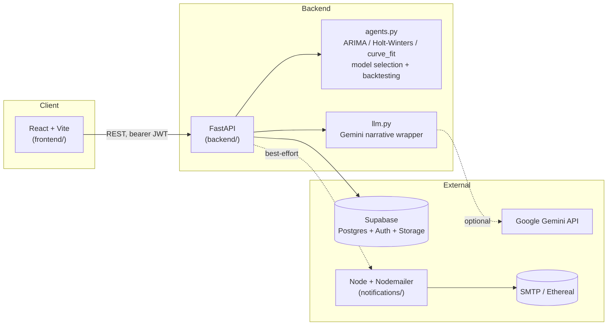

# Prism

B2B sales analytics platform: upload historical sales data and get back
three revenue forecasts — pessimistic, expected, and optimistic — each
produced by a statistical model that was selected and backtested against
your own data, plus an AI-written executive summary and email notification
when the forecast is ready.

## Architecture



- **Frontend** — React 19 + Vite + Tailwind + Recharts. Auth, CSV/Excel upload, and a results dashboard with per-scenario forecast charts.
- **Backend** — FastAPI. Auth/company scoping via Supabase Auth, file storage via Supabase Storage, structured results in Postgres (`reports` table).
- **Forecasting engine** (`backend/agents.py`) — see below.
- **Gemini narrative layer** (`backend/llm.py`) — optional; turns the three structured forecasts into a short executive summary.
- **Notifications** (`notifications/`) — a separate Node/Express + Nodemailer service the backend calls (best-effort, never blocks the analysis) after a report finishes.

## How the forecasting works

Uploading a file with `date`, `revenue`, `units_sold`, `product`, `region`
columns (auto-detected from close matches) runs one pipeline per report.

### In plain English

Revenue is added up into one number per day, giving a timeline. Three
different forecasting methods are then each shown *only* the older part of
that timeline and asked to predict the most recent two weeks *blind* — the
model never gets to see those real answers while guessing. Once all three
have guessed, the real values for those two weeks are revealed and each
model is graded on how close it got. Whichever method scored best is refit
on the *entire* timeline (now including those two weeks) to produce the
actual 30-day forecast, and its own uncertainty range becomes the three
scenarios: the pessimistic end of that range, the single best-guess number,
and the optimistic end. Because every model is graded against real held-out
answers before being trusted, the accuracy number shown on screen is
measured, not asserted — it changes based on how forecastable your actual
data is, which is also why it's honest to see a mediocre score on genuinely
noisy sales data rather than a suspiciously perfect one.

### The pipeline, precisely

1. **Model selection.** Three candidate forecasters are fit on a holdout
   split of your daily revenue series:
   - ARIMA, grid-searched over `(p,d,q) ∈ {0,1,2}³` and picked by lowest AIC
   - Holt-Winters / Holt linear trend exponential smoothing (`statsmodels`)
   - A log-linear growth curve fit via `scipy.optimize.curve_fit`
   (`agents.select_and_forecast`, `agents.backtest_candidates`)
2. **Backtesting.** Each candidate is scored against the actual held-out
   days (MAPE / RMSE / MAE); the lowest-MAPE model wins and is refit on the
   full series for the real 30-day forecast. The winning model and its
   backtested accuracy are shown on every scenario tab — this is real,
   computed accuracy, not a hardcoded number.
3. **Scenario forecasts.** The winning model's confidence band becomes the
   three agents: **conservative** = lower bound, **moderate** = point
   forecast, **aggressive** = upper bound. Each agent also carries its own
   supporting analysis — conservative breaks down revenue by region/product,
   aggressive runs an Isolation Forest over revenue/units/day-of-week/month
   to flag anomalous sales events that could swing the optimistic case.
4. **AI summary.** If `GEMINI_API_KEY` is set, the three structured forecasts
   are sent to Gemini for a short plain-English executive summary. If it's
   not set (or the call fails/times out), the report still completes —
   this step never blocks the ML pipeline.

Run `pytest` in `backend/` to see this exercised against real
statsmodels/scipy/scikit-learn fits on deterministic synthetic data
(risk-ordering, backtest sanity checks, graceful degradation on thin data).

### Decoding a results screen

Every scenario tab shows a line like `Model: ARIMA(2, 0, 2) · Backtested
accuracy: 62.8% (MAPE 37.21%, 14-day holdout)`. Term by term:

| You see | It means |
|---|---|
| `ARIMA(p, d, q)` | ARIMA won the backtest. `p` = how many past days it directly looks at, `d` = how many times the trend was stripped out before modeling, `q` = how much it self-corrects based on its own recent prediction errors. `(2, 0, 2)` = looks at the last 2 days, uses the raw numbers as-is, self-corrects using the last 2 errors. |
| `AIC` (used to pick the order) | A score for comparing candidate ARIMA orders that rewards a better fit but penalizes needless complexity, so it won't pick an overly elaborate model just because it fits training data slightly better. |
| `holdout` | The most recent N days of your real data, deliberately hidden from the model during the accuracy test — like exam questions the model never studied from. |
| `MAPE` | Mean Absolute Percentage Error — averaged over every holdout day, `\|predicted − actual\| ÷ actual`. 37% MAPE means the model's guess was off by ~37% of the true value, on average, on days it hadn't seen. |
| `Backtested accuracy` | Just `100% − MAPE`, shown as a friendlier "how right" framing of the same measured number. |
| `Confidence band / scenario range` | The spread between the pessimistic and optimistic forecasts — how uncertain the winning model is about the future, wider when your data is noisier. |
| `Anomalies` (Isolation Forest) | Individual sales that look statistically unusual across revenue/units/day-of-week/month compared to the rest of your data — found algorithmically, not flagged by hand. |

## Setup

### 1. Backend (FastAPI)

```bash
cd backend
python3 -m venv venv && source venv/bin/activate
pip install -r requirements.txt
cp .env.example .env   # fill in SUPABASE_URL / SUPABASE_KEY at minimum
uvicorn main:app --reload
```

One-time Supabase migration (SQL editor) to store the AI summary — the app
works without it, it just skips saving `ai_summary`:

```sql
alter table reports add column if not exists ai_summary text;
```

### 2. Frontend (React)

```bash
cd frontend
npm install
cp .env.example .env   # VITE_API_URL, defaults to http://127.0.0.1:8000
npm run dev
```

### 3. Notifications (Node + Nodemailer) — optional

```bash
cd notifications
npm install
cp .env.example .env   # leave SMTP_HOST unset to use a free Ethereal test inbox
npm start
```

### Try it with sample data

`sample_data/demo_sales.csv` (regenerate with `python scripts/generate_demo_data.py`)
is ~180 days of synthetic multi-region, multi-product B2B sales with a real
trend, weekly seasonality, and a few injected anomalies — sign up, upload
it, and you'll get all three scenario forecasts, backtested accuracy, and
(if configured) an AI summary and a notification email.

## Environment variables

| Service | Variable | Required | Notes |
|---|---|---|---|
| backend | `SUPABASE_URL`, `SUPABASE_KEY` | yes | Project Settings → API |
| backend | `CORS_ORIGINS` | no | comma-separated, defaults to `http://localhost:5173` |
| backend | `GEMINI_API_KEY` | no | free key at aistudio.google.com/apikey; summary is skipped without it |
| backend | `GEMINI_MODEL` | no | defaults to `gemini-2.5-flash` |
| backend | `NOTIFY_SERVICE_URL`, `NOTIFY_SERVICE_API_KEY` | no | notification is skipped if unreachable |
| backend | `FRONTEND_URL` | no | used to build the link inside notification emails |
| frontend | `VITE_API_URL` | no | defaults to `http://127.0.0.1:8000` |
| notifications | `SMTP_HOST`/`PORT`/`USER`/`PASS`, `FROM_EMAIL` | no | unset → auto Ethereal test inbox |
| notifications | `NOTIFY_API_KEY` | no | shared secret with the backend's `NOTIFY_SERVICE_API_KEY` |

## Security notes

- Every upload/report is scoped to the caller's `company_id` (resolved
  server-side from the authenticated Supabase user), not just checked
  against `uploaded_by` — teammates at the same company can see each
  other's analyses, and a report ID from another company returns 403.
- `backend/venv` is gitignored; if you're publishing this repo publicly and
  it was ever committed in an earlier snapshot, scrub it from history
  (`git filter-repo`) before making the repo public, and rotate any keys
  that were committed alongside it.
